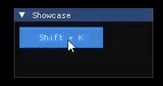

# ImHotkey
Compact ImGui extension to implement simple hotkey assignment through input capture.

  

## Adding the extension
Drop `ImHotkey.h` and `ImHotkey.cpp` into the folder containing your ImGui setup - *This project does not ship with one!*

Only copy the two files mentioned, the rest of the projects files are exclusively for testing and development purposes.

## How does it work?
The underlying widget is an `ImGui::Button` that can be clicked to start the capture, the hotkey values are stored in a custom container `ImHotkeyData_t`.
Communication between your interface and the API is your responsibility to implement and should be rather straightfoward. 

To capture the inputs, the extension spins up threads whch hook into low-level keyboard (`WH_KEYBOARD_LL`) and mouse (`WH_MOUSE_LL`) event 
handling to put the captured inputs in the hotkey until the capture has ended, the hooks are then removed again.

To display the hotkey text on the button, each `ImHotkeyData_t` creates a unique ID when it is created, the label of the button will then be set to
`{key combination}##{id}` which allows things to share the same hotkeys without the widgets unintentionally using the same label.

The capture is automatically ended when no key or mouse button is being held down anymore. The color of the text visually indicates whether a capture is ongoing.

## Features
- Capture mouse buttons (left, right, middle, mouse4, mouse5).
- Capture keyboard, including modifiers (shift, alt, ctrl), independent of keyboard layout
- Exclude capture of keyboard / mouse / modifiers through flags.
